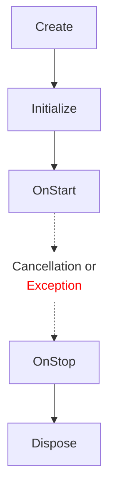
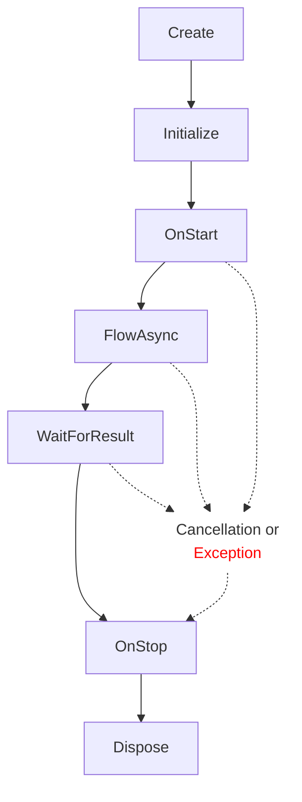

# Hierarchical Model-View-Controller (HMVC) Framework for Unity
Welcome to the Hierarchical Model-View-Controller (HMVC) Framework for Unity, a robust and scalable solution tailored for mobile game development. This framework builds on the traditional Model-View-Controller (MVC) pattern by adding a hierarchical structure that enhances modularity and code organization throughout the game flows. With HMVC, developers can create complex game architectures while maintaining a clear separation of concerns. It facilitates easier testing, debugging, and feature extension, making it an ideal choice for mobile games that require both flexibility and maintainability. Whether you're building a simple puzzle game or an intricate role-playing adventure, the HMVC Framework provides a strong foundation to accelerate your development process.

## Table Of Contents

<details>

- [Hierarchical Model-View-Controller (HMVC) Framework for Unity](#hierarchical-model-view-controller-hmvc-framework-for-unity)
  - [Table Of Contents](#table-of-contents)
  - [Installation](#installation)
  - [Quick Start](#quick-start)
  - [Why HMVC/HMVP?](#why-hmvchmvp)
    - [Pros of HMVC/HMVP](#pros-of-hmvchmvp)
    - [Cons of HMVC/HMVP](#cons-of-hmvchmvp)
  - [Types of Controllers And Their Lifecycle](#types-of-controllers-and-their-lifecycle)
    - [`ControllerBase` and `ControllerBase<TArg>`](#controllerbase-and-controllerbasetarg)
    - [`ControllerWithResultBase`, `ControllerWithResultBase<TArg>`, `ControllerWithResultBase<TResult>`, `ControllerWithResultBase<TArg, TResult>`](#controllerwithresultbase-controllerwithresultbasetarg-controllerwithresultbasetresult-controllerwithresultbasetarg-tresult)
  - [Binding](#binding)
  - [Error Handling](#error-handling)
  - [Unit Testing](#unit-testing)
  - [Dependencies](#dependencies)

</details>

## Installation
Install via UPM and the Git URL:

Navigate to your project Packages folder and modify the manifest.json file.
Add this line below the "dependencies": { line
```json
"com.playtika.controllers-tree": "https://github.com/PlaytikaOSS/controllers-tree.git?path=src/ControllersTree#v1.1.0",
```
Reload the project and UPM will install the package.


## Dependencies
The package uses [UniTask](https://github.com/Cysharp/UniTask) for managing async flows and async/await integration.


## Why HMVC/HMVP?
Unity's default approach to game development relies on component-oriented programming (setting aside Entity Component System for now).

In this approach, an OOP class (inheriting from MonoBehaviour) consists of a set of data and methods to modify and display it. Encapsulation requires that this data be hidden from outside access and changed only through the provided methods. As a result, classes often become quite large, even when broken down into individual components. While inheritance can address some of these issues, it may complicate readability. Additionally, interactions between components are managed through events or specific classes. Coordinating these components isn’t straightforward; managing synchronization can lead to callback complexities, making it harder to understand over time.

The **MVC/MVP** approach changes this principle. Data is put into **model or models** (a model is a class for storing data). Usually, a model has two interfaces: one for reading only and the other for changing data. This is done to easily separate who reads data from who changes it. In some projects, models contain APIs and methods to change data, while sometimes they contain only data.

Next is the **view** – in Unity, it's a MonoBehaviour, with objects for display/input. There is no logic in them, just output and input data.

Finally, **controllers** are classes responsible for business logic. Here's an important distinction: if in OOP a unit is a class (a set of data and methods to change and display them), then **in MVC/MVP, a controller is a unit of executable work, an operation (following the "Command" pattern)**. The **controller itself has no public methods** and does not contain any data. The result of its work is usually changes in models or views, access to certain services, or the launching of other controllers. A controller can only be started from another controller (except the root). This ensures a **code-first approach**.

For example, in OOP, there is an inventory that has methods for adding items to it, deleting them, saving the inventory, and reading it. If it's a MonoBehaviour, it most likely also displays itself, resulting in a class with a large set of methods.

In **MVC/MVP**, each controller is essentially a "command" pattern (for a controller with a result). If you need to save, the save controller starts; it injects the models to be saved to a file (read-only interfaces) and possibly some service for working with files, then saves them. That's it. There's no additional logic in this controller; for example, another controller will be responsible for reading. This approach keeps controllers as small classes (usually 200-300 lines of code), which are only responsible for their operation. Also, since the controller injects several models, it is unnecessary to notify different classes about saving. This approach reduces the number of events. Each controller has one zone of responsibility – SRP (the single responsibility principle) right out of the box, which will satisfy solid design enthusiasts.


**The H in HMVP/HMVC means "hierarchical".**
Controllers are organized in a tree structure
with a single entry point, the **RootController**.
Other controllers spawn within parent controllers.
This code-first approach enhances readability and predictability,
unlike the unpredictable execution order in MonoBehaviors' Awake/Start.

**The controller lifecycle uses the "strategy" pattern**,
ensuring consistent coding style and safer error handling
across the project.
This standardisation simplifies understanding
and maintaining the codebase.

The separation of logic, data, and view makes testing easier,
though initial view mocking may be needed.

Controllers handle all interactions between the model and view
and are part of our established "Controller Tree".
In this setup, the view and model remain isolated.

### Pros of HMVC/HMVP

- **Single entry point** and code-centric approach.
- **Small classes**: ~200 lines on average.
- **Pure C#** (except for views, where MonoBehaviors remain),
  making migration from Unity easier.
  Reduces the costly overhead of frequent context switching between managed C# and unmanaged C++ environments.
- **Easier navigation, debugging, and code search**
  due to structured organization without callback hell.
- **High code maintainability**, allowing easy understanding
  for those familiar with the architecture.
- **Good scalability**, with features being isolated.
- **SRP** - Single Responsibility Principle.
- **Fewer risks to break something** due to SRP,
  as controllers have clear responsibilities.
  Although implicit dependencies exist, they're minimal.
- **Easier tests**, though there is some boilerplate.
- **Easier to work in a large team** (about 40 client developers on each project,
  all actively changing the code).
- **Relatively safe flow, using try/catch**.

### Cons of HMVC/HMVP

- **Boilerplate** - requires writing more code.
- Controllers being classes means they **create garbage and add load to GC**
  (not large, but still can't be avoided).
- **Not especially fast code** due to many asynchronous operations,
  allocations, and try/catch overhead.

## Types of Controllers And Their Lifecycle

All controllers are instantiated via a factory that injects dependencies
and provides additional parameters, such as arguments and a cancellation token.

### `ControllerBase` and `ControllerBase<TArg>`
**ControllerBase** is the basic form of a controller.
It is a class created with or without arguments
and remains active until destroyed by the parent controller,
often used as a handler.
It cannot independently complete its lifecycle
or return a result.

**ControllerBase** is created as follows:
```csharp
Execute<MyControllerBase>();
Execute<MyControllerBase, MyControllerBaseArgs>(args);
```



After creating the controller and setting up arguments,
the virtual method **OnStart()** is called.
Here, you can make necessary subscriptions and implement logic.

For resources implementing the IDisposable interface
that require disposal upon the controller's destruction,
use **AddDisposable(IDispose)**.

**ControllerBase** remains active until the parent controller
is destroyed, at which point the virtual method **OnStop()**
is invoked, and any objects added to the disposables list
are disposed of.

In case of an exception during startup, both **OnStop**
and **Dispose** are called for all disposable objects.

### `ControllerWithResultBase`, `ControllerWithResultBase<TArg>`, `ControllerWithResultBase<TResult>`, `ControllerWithResultBase<TArg, TResult>`
**ControllerWithResultBase** is invoked with or without arguments,
executes a task, and returns a result.
The calling controller can choose to start this controller
and wait for its result, or start it and disregard the result.

**ControllerWithResultBase** serves as the primary work unit
and represents an asynchronous implementation of
the "command" pattern.

Basically, it works like calling an asynchronous
method and awaiting its result:

```csharp
await DoSomethingAsync(CancellationToken); // ControllerWithResultBase

await DoSomethingAsync(args, CancellationToken); // ControllerWithResultBase<TArg>

var result = await DoSomethingAsync(CancellationToken); // ControllerWithResultBase<TResult>

var result = await DoSomethingAsync(args, CancellationToken); // ControllerWithResultBase<TArg, TResult>
```



The lifecycle of a controller starts with dependencies being injected and **OnStart()** method invoked.

After that, the controller enters its asynchronous process with **OnFlowAsync()**.

The **Complete(TResult)** method is then called to end the controller's tasks
and return the result to the caller.

Following this, **OnStop()** is executed,
and finally, all disposable objects are cleaned up with **Dispose()**.
> **If the Complete method is invoked within OnStart() and the controller finishes within OnStart, then OnFlowAsync() will be skipped, allowing the controller to operate synchronously. Alternatively, it is possible to complete the controller during or after OnFlowAsync, such as by subscribing to an event and acting upon it.**

> **If an error occurs in OnStart or OnFlowAsync, the Exception will be propagated to the parent controller. In all other cases, you must handle the Exception yourself and invoke the Fail(Exception) method on the controller.**

**ControllerWithResultBase** is started in the following way:

```csharp
await ExecuteAndWaitResultAsync<MyControllerWithResult>(CancellationToken);
await ExecuteAndWaitResultAsync<MyControllerWithResult, MyControllerWithResultArgs>(args, CancellationToken);
var result = await ExecuteAndWaitResultAsync<MyControllerWithResult, MyResult>(CancellationToken);
var result = await ExecuteAndWaitResultAsync<MyControllerWithResult, MyControllerWithResultArgs, MyResult>(args, CancellationToken);
```

It can also be invoked using the **FireAndForget()** extension, executed without _await_.

## Binding

Controllers are not reusable, a **new controller must be created each time** by the factory. **Controllers are always bound as Transient**.

As for the **controller factory IControllerFactory, it should be created each time a new DI scope** (context) is created and passed to the controller so that subsequent controllers create instances using this factory.

The **controllers factory should be bound on the root level as Scoped** (a new factory instance is created for each scope). Also, as an option, you can bind as Singleton and rebind at each child level. It will work, but it is not desirable to do so.

## Error Handling
Usually, a feature starts with the `FeatureRootController` which spawns child controllers. If an exception occurs in `OnStart` (for `ControllerBase`), in `OnFlowAsync`, or when `Fail` is called in `ControllerWithResult`, the exception will propagate up the call stack until it's caught by a try/catch block. It’s recommended to catch exceptions in the root controller of the feature, which allows you to handle errors in one place, stop the feature, and prevent the error from spreading further.

```
    FeatureRootController (catch exceptions here)
      FeatureController1
      FeatureController2
        FeatureController2a
        FeatureController2b (exception here)
```

```csharp
public class FeatureRootController : ControllerWithResultBase
{
    ...
    protected override async UniTask OnFlowAsync(CancellationToken cancellationToken)
    {
        try
        {
            await ExecuteAndWaitResultAsync<FeatureController1>(cancellationToken);

            ...

            await ExecuteAndWaitResultAsync<FeatureController2>(cancellationToken);
        }
        catch (Exception exception)
        {
            Debug.LogError($"Exception in {Name}", exception);
        }
    }
}

public class FeatureController2b : ControllerWithResultBase
{
    ...

    protected override UniTask OnFlowAsync(CancellationToken cancellationToken)
    {
        throw new Exception("Exception in FeatureController2b");
    }
}
```

There are cases where it makes sense to catch errors at a lower level, for example, if there is a fallback to another flow or if you need to add the controller call data to the exception and rethrow, but for a safe flow at the feature controller level, it’s essential to catch errors there.

```
    FeatureRootController (catch exceptions here)
      FeatureController1
      FeatureController2 (catch, add params to exception, rethrow)
        FeatureController2a
        FeatureController2b (exception here)
```

```csharp
public class FeatureController2 : ControllerWithResultBase
{
    ...

    protected override async UniTask OnFlowAsync(CancellationToken cancellationToken)
    {
        try
        {
            string bundleId = "ChristmasBundle";
            ...
            await ExecuteAndWaitResultAsync<FeatureController2b>(cancellationToken);
        }
        catch (Exception exception)
        {
            exception.Data.Add("BundleId", bundleId);
            throw;
        }
    }
}
```

For other cases (besides `OnStart` and `OnFlowAsync`), you need to catch exceptions yourself and call Fail to stop the controller (for `ControllerWithResult`). `ControllerBase` can only be stopped by the parent controller.

```csharp
public class FeatureController2a : ControllerWithResultBase
{
    ...

    protected override void OnStart()
    {
        base.OnStart();
        _engineEvents.Win += OnWin;
    }
    
    protected override void OnStop()
    {
        _engineEvents.Win -= OnWin;
        base.OnStop();
    }
    
    private void OnWin()
    {
        try
        {
            ...
        }
        catch (Exception exception)
        {
            Fail(exception);
        }
    }
}
```

## Unit Testing
For unit testing the controller, the framework includes a mock factory to substitute controllers. It also provides a TestRootController to run any controller.

Given a tree like this:
```plaintext
...
    FeatureRootController
      FeatureController1
      FeatureController2
        FeatureController2a
        FeatureController2b
```

For example, if we want to test FeatureController2, we can start part of the tree from any controller.

```plaintext
...
    TestRootController (test root controller)
      FeatureController2
        FeatureController2a
        FeatureController2b
```
```csharp
[Test]
public async Task FeatureController2_ExecuteAndWaitResult_NoExceptionThrown()
{
    var substituteControllerFactory = new SubstituteControllerFactory();
    var myModelMock = Substitute.For<IMyModel>();

    var featureController2 = new FeatureController2(
        substituteControllerFactory,
        myModelMock);

    substituteControllerFactory.AddInstance(featureController2);

    var featureController2a = new FeatureController2a(
        substituteControllerFactory);

    substituteControllerFactory.AddInstance(featureController2a);

    var featureController2b = new FeatureController2b(
        substituteControllerFactory);

    substituteControllerFactory.AddInstance(featureController2b);

    var rootController = new TestRootController(ControllerFactory);
    rootController.LaunchTree(CancellationToken);

    try
    {
        await rootController.ExecuteAndWaitResultAsync<FeatureController2>(CancellationToken);
    }
    catch (Exception exception)
    {
        // handle exception
    }

    // handle test results
}
```

Alternatively, you can replace any controllers with mocks (for controllers with results, you can specify the exact result each controller should return, and also indicate whether this should be done synchronously or asynchronously).

```plaintext
...
    TestRootController (test root controller)
      FeatureController2
        FeatureController2a (mock)
        FeatureController2b (mock)
```
```csharp
[Test]
public async Task FeatureController2_ExecuteAndWaitResult_NoExceptionThrown()
{
    var substituteControllerFactory = new SubstituteControllerFactory();
    var myModelMock = Substitute.For<IMyModel>();

    var featureController2 = new FeatureController2(
        substituteControllerFactory,
        myModelMock);

    substituteControllerFactory.AddInstance(featureController2);

    substituteControllerFactory.AddResultFor<FeatureController2a>(MyResult.Ok);

    var rootController = new TestRootController(ControllerFactory);
    rootController.LaunchTree(CancellationToken);

    try
    {
        await rootController.ExecuteAndWaitResultAsync<FeatureController2>(CancellationToken);
    }
    catch (Exception exception)
    {
        // handle exception
    }

    // handle test results
}
```

In this case, only FeatureController2 will run, and all internal calls to other controllers will be replaced with mocks that have the specified result. For controllers without a result, you don't need to specify anything; default mocks will be created for them.

You can also simulate an exception when launching a child controller by calling the method AddExceptionFor<TController>(Exception).

```csharp
public enum ControllerBehaviour
{
    CompleteOnStart,
    CompleteOnFlowAsync,
    NeverComplete,
    FailOnStart,
    FailOnFlowAsync,
}

substituteControllerFactory.SetBehaviourFor<FeatureController2b>(ControllerBehaviour.CompleteOnFlowAsync);
```
For tests where the controller call needs to be asynchronous, or the controller should fail or never complete, you can modify the mock behaviour:

```csharp
public enum ControllerBehaviour
{
    CompleteOnStart,
    CompleteOnFlowAsync,
    NeverComplete,
    FailOnStart,
    FailOnFlowAsync,
}

substituteControllerFactory.SetBehaviourFor<FeatureController2b>(ControllerBehaviour.CompleteOnFlowAsync);
```