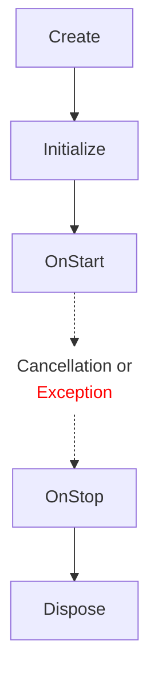
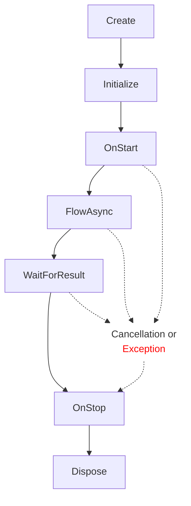

## Установка
Чтобы установить пакет через UPM и Git URL, вам нужно перейти в папку Packages вашего проекта и отредактировать файл manifest.json.

Добавьте следующую строку после строки "dependencies": {
```json
"com.playtika.valuetask-controllers-tree": "https://github.com/perepechenko/valuetask-controllers-tree.git?path=src/ControllersTree",
```
Перезагрузите проект, и UPM установит пакет.

## Зачем всё это надо, почему HMVC/HMVP ?
Обычно в Unity для разработки игр используется самый простой способ, который предлагает сама Unity - это компонентно-ориентированное программирование (пока не рассматриваем ECS). 

Подход выглядит примерно так: каждый компонент это ООП класс унаследованный от MonoBehaviour - набор данных, и методов для их изменения (какой-то бизнес логики), и отображения. 
Причем инкапсуляцию требует чтобы эти данные были максимально скрыты извне, и изменялись только предоставленными методами. 
За счет этого, во-первых, сами классы становятся достаточно большими даже с учетом разбивки на отдельные компоненты (наследованные отчасти решает эту проблему, ценой усложнения читаемости). 
А так же для взаимодействия между собой используются эвенты либо какие-то классы которые управляют всем этим. Заставить всё это взаимодействовать между собой иногда нелегкая задача, заводятся какие-то классы которые все это синхронизируют, иногда бывает настоящий колбек хол, и порой в этом бывает трудно разобраться даже авторам, спустя какое-то время.


В подходе **MVC/MVP** этот принцип меняется. Данные выносятся в **модель или модели** (модель это класс для хранения данных).
Обычно у модели 2 интерфейса - один только на чтение, другой на изменение данных. Делается это для того, чтобы легко отделить тех кто читает данные, от тех кто их меняет.
На некоторых проектах модели содержат API и методы для изменения данных, иногда - только данные.

Далее **представление** (вью) - в Unity это MonoBehaviour, с объектами для отображения/ввода. никакой логики в них нет, только вывод и ввод данных.

И наконец **контроллеры**, по сути это классы отвечающие за бизнес логику.
Тут есть важный момент - если в ООП единица - это класс (набор данных и методов их изменения и отображения), то в **MVC/MVP контроллер - это единица какой-то выполнимой работы, операция (паттерн "Команда")**.
Сам контроллер не имеет публичных методов и не содержит в себе каких то данных, результат его работы обычно какие-то изменения в моделях, либо во вьюхах, либо обращение к каким-то сервисам, либо запуск других контроллеров.
Контроллер может быть запущен только из другого контроллера (кроме рута).
Этим обеспечивается **code-first подход**.

Поясню на примере: в ООП есть инвентарь к примеру, там есть и методы добавления в него, и удаления, и сохранение инвентаря, и чтения, а если это MonoBehaviour - то скорее всего еще и отображение. Класс с большим набором методов.

Итак, в **MVC/MVP каждый контроллер - это по сути паттерн «команда» (для контроллера с результатом)**. Если надо сохранить - то запускается контроллер сохранения, он инжектит модели которые надо сохранить в файл (интерфейсы только для чтения), возможно какой-то сервис для работы с файлами, и сохраняет. И всё, в этом контроллере больше нет никакой другой логики, к примеру за чтение будет отвечать уже совсем другой контроллер. За счет этого контроллеры остаются маленькими классами (обычно прялдка 200-300 строк), которые отвечают только за свою операцию. Так же так как контроллер инжектит несколько моделей - не надо уведомлять разные классы скажем о сохранении, такой подход позволяет уменьшить число эвентов. У каждого контроллера 1 зона ответственности - SRP (single responcibility) из коробки, любители солида останутся довольны.


H в **HMVP/HMVC означает hierarchical**. То есть контроллеры выстроены иерархически, в дерево. Есть единая точка входа, RootController, и остальные контроллеры можно породить только внутри родительского контроллера. Code-first подход, код намного легче читается и более предсказуемо работает. Те, кто сталкивался с логикой которая стартует в MonoBehaviour в Awake/Start понимают о чем я и какой хаос может быть, когда при загрузке сцены стартует несколько скриптов и надо учитывать кто за кем, заглядывая в экзекюшен ордер.

**Жизненный цикл контроллера строго стандатизован (паттерн "стратегия")**, более подробно расскажу ниже. За счет этого во-первых все участники проекта пишут в одном стиле, так как стандартизация заставляет следовать определенным правилам, и код на проекте консистентный, при таком подходе намного проще разобраться в фиче в которую ты первый раз заглядываешь. Во-вторых, флоу сделан безопасным, есть некоторая гарантия что даже в случае какой-то ошибки контроллер остановится корректно и ошибка будет обработана.

Так как идет разделение логики и данных (и отображения), проще писать тесты на такой контроллер. Хотя первый раз надо мокать вьюхи, но в целом намного легче.

Один ньюанс с нашими контроллерами: рельно если смотреть на схему, то видно что в если вьюха не общатеся напрямую с моделью и все взаимодействия и с моделью и с вьюхой делает контроллер, то такой контроллер называется "презентер", а подход MVP. Но так уж сложилось, что технология внутри компании имеет устоявшееся название "Дерево контроллеров", **пусть наши контроллеры которые на самом деле презентеры называются контроллерами**. Но в нашей релизации вьюха не знает ни про кого, модель не знает ни про кого, контроллер знает про всех. Так же, как упоминалось выше, модель - это только данные, там нет логики для их обработки (в некоторых других релизациях MVXXX там бывает и логика).

### Итак, подведу кратки итог, плюсы HMVC/HMVP:
- **Единая точка входа и код центрик подход**.
- **Мелкие классы** (~200 строк в среднем, при переводе легаси подхода методы из monobeh расходятся по контроллерам).
- **Чистый С#** (кроме вьюх, там MonoBehaviours остаются), в случае миграции с Unity намного проще. Так же пинг-понг C#/C++ стоит дорого.
- **Проще навигация, отладка и поиск по коду** - всё структурировано и легко найти где что происходит, нет колбек хэла.
- **Высокая поддерживаемость кода**, человеку знакомому с архитектурой достаточно легко разобраться.
- **Хорошо масштабируется**, фичи выходят достаточно изолированные.
- **SRP** - single responsibility principe.
- **Меньше рисков поломать** - за счет SRP, в целом точно знаешь за что отвечает контроллер, есть конечно неявные зависимости, но в целом шансы сломать меньше
- **Проще тесты** (хотя есть некоторый бойлерплейт).
- **Легче работать в большой команде** (у нас клиентских разработчиков примерно порядка 40 человек на каждом проекте, все активно меняют код).
- **Относительно безопасный флоу, try/catch**.
### Минусы:
- **Бойлерплейт** - приходится писать больше кода.
- Контроллеры это классы, поэтому **в процессе работы создают мусор и нагружают GC** (не большие по размеру, но содержат ссылки, в общем небольшая нагрузка есть).
- **Не особо быстрый код**, за счет большого количества асинхронных операций, аллокейтов и за счёт использования try/catch.

### Виды контроллеров и их лайфсайкл:
Все контроллеры порождаются через фабрику, которая инжектит все зависимости, потом прокидывает то что не инжектится (аргументы если они есть и канселейшен токен).

### 1) ControllerBase и ControllerBase<TArg>
   ControllerBase - базовый вариант контроллера, это класс который создается (с аргументами либо без) и присутствует, пока его не уничтожит родительский контроллер, обычно используется как хэндлер. Он не может сам завершить свой жизненный цикл и вернуть какой-то результат.

   ControllerBase запускается так:

```csharp
Execute<MyControllerBase>();
Execute<MyControllerBase, MyControllerBaseArgs>(args);
```



После создания контроллера и сета аргументов вызывается виртуальный метод **OnStart()**. Можно сделать любые подписки, и реализовать нужную логику.

Если есть какие-то ресурсы, у которых реализован интерфейс IDisposable и надо вызвать Dispose при уничтожении контроллера - можно добавить их вызовам **AddDisposable(IDispose);**

ControllerBase висит до тех пор, пока не будет уничтожен родительский контроллер, после этого вызывается виртуальный метод **OnStop(),** а потом диспозится всё что было добавлено в список диспосибл объектов.

Так же в случае возникновения исключения при старте контроллера будет вызван OnStop и Dispose у всех диспосибл объектов.

### 2) ControllerWithResultBase, ControllerWithResultBase< TArg>, ControllerWithResultBase< TResult>, ControllerWithResultBase<TArg, TResult>

ControllerWithResultBase - этот контроллер запскается (с аргементами либо без), выполняет какую-то работу, и возвращает результат. В вызывающем контроллере можно заавейтить работу этого контроллера и дождаться его результата, либо запустить и забыть. **ControllerWithResultBase основная рабочая еденица, и реализация паттерна "команда" в асинхронном виде**.

Совсем упрощенно можно себе представлять это вызов какого-то асинхронного метода и ожидание его результата:

```csharp
await DoSomethingAsync(CancellationToken); // ControllerWithResultBase

await DoSomethingAsync(args, CancellationToken); // ControllerWithResultBase<TArg>

var result = await DoSomethingAsync(CancellationToken); // ControllerWithResultBase<TResult>

var result = await DoSomethingAsync(args, CancellationToken); // ControllerWithResultBase<TArg, TResult>
```



Только в отличие от метода, контроллер перед стартом вызовется **OnStart()**, потом асинхронный флоу контроллера **OnFlowAsync()**, а так же в контроллер можно заинжектить зависимости. Далее в контроллере вызывается метод **Complete(TResult)** который завершает работу контроллера и возвращает результат вызвавшему контроллеру. После этого вызывается **OnStop()** и потом **Dispose()** у всех диспосибл объектов.

> **Если метод Complete вызван в OnStart() и был вызов Complete в OnStart - то OnFlowAsync() уже не вызовется и вызов контроллера произойдет синхронно. Так же можно вызвать Complete в OnFlowAsync либо после него, например, подписавшись на эвент и при получении этого эвента.**

> **В случае ошибки в OnStart либо OnFlowAsync исключение будет передано в родительский контроллер, в остальных случаях надо обработать исключение самому и вызывать метод Fail(Exception) для контроллера.**

ControllerWithResultBase запускается так:

```csharp
await ExecuteAndWaitResultAsync<MyControllerWithResult>(CancellationToken);
await ExecuteAndWaitResultAsync<MyControllerWithResult, MyControllerWithResultArgs>(args, CancellationToken);
var result = await ExecuteAndWaitResultAsync<MyControllerWithResult, MyResult>(CancellationToken);
var result = await ExecuteAndWaitResultAsync<MyControllerWithResult, MyControllerWithResultArgs, MyResult>(args, CancellationToken);
```

Так же можно запустить и забыть (без авейта).

### Описание свойств и методов контроллеров:

### ControllerBase

Свойства:
- **string Name** - свойство, возвращает имя контроллера.
- **CancellationToken CancellationToken** - токен отмены, при исключении или остановке контроллера он отменяется.

Методы:
- **void OnStart** - виртуальный метод, вызывается при запуске контроллера. Удобен для подписок на события.
- **void OnStop** - виртуальный метод, вызывается при остановке контроллера (в том числе и при ошибке). Удобен для отписок от событий.
- **void AddDisposable(IDisposable disposable)** - добавить диспосибл объект. После остановки контроллера будет вызван Dispose у всех добавленных объектов.
- **void AddDisposables(IEnumerable<IDisposable> collection)** - добавить коллекцию диспосибл объектов. После остановки контроллера будет вызван Dispose у всех добавленных объектов.

- **void Execute<T>()** - запустить дочерний контроллер ControllerBase.
- **void Execute<T, TArg>(TArg args)** - запустить дочерний контроллер ControllerBase с аргументами TArg.
- **void Execute<T>(IControllerFactory factory)** - запустить дочерний контроллер ControllerBase с новой фабрикой контроллеров.
- **void Execute<T, TArg>(TArg arg, IControllerFactory factory)** - запустить дочерний контроллер ControllerBase с аргументами TArg и новой фабрикой контроллеров.

- **ValueTask ExecuteAndWaitResultAsync<T>(CancellationToken cancellationToken)** - запустить дочерний контроллер ControllerWithResultBase и дождаться его завершения. CancellationToken позволяет отменить ожидание.
- **ValueTask ExecuteAndWaitResultAsync<T, TArg>(TArg arg, CancellationToken cancellationToken)** - запустить дочерний контроллер ControllerWithResultBase с аргументами TArg и дождаться его завершения. CancellationToken позволяет отменить ожидание.
- **ValueTask<TResult> ExecuteAndWaitResultAsync<T, TResult>(CancellationToken cancellationToken)** - запустить дочерний контроллер ControllerWithResultBase и дождаться его завершения с результатом TResult. CancellationToken позволяет отменить ожидание.
- **ValueTask<TResult> ExecuteAndWaitResultAsync<T, TArg, TResult>(TArg arg, CancellationToken cancellationToken)** - запустить дочерний контроллер ControllerWithResultBase с аргументами TArg и дождаться его завершения с результатом TResult. CancellationToken позволяет отменить ожидание.
- **ValueTask ExecuteAndWaitResultAsync<T>(IControllerFactory factory, CancellationToken cancellationToken)** - запустить дочерний контроллер ControllerWithResultBase c новой фабрикой контроллеров и дождаться его завершения. CancellationToken позволяет отменить ожидание.
- **ValueTask ExecuteAndWaitResultAsync<T, TArg>(TArg arg, IControllerFactory factory, CancellationToken cancellationToken)** - запустить дочерний контроллер ControllerWithResultBase с аргументами TArg и новой фабрикой контроллеров, и дождаться его завершения. CancellationToken позволяет отменить ожидание.
- **ValueTask<TResult> ExecuteAndWaitResultAsync<T, TResult>(IControllerFactory factory, CancellationToken cancellationToken)** - запустить дочерний контроллер ControllerWithResultBase c новой фабрикой контроллеров и дождаться его завершения с результатом TResult. CancellationToken позволяет отменить ожидание.
- **ValueTask<TResult> ExecuteAndWaitResultAsync<T, TArg, TResult>(TArg arg, IControllerFactory factory, CancellationToken cancellationToken)** - запустить дочерний контроллер ControllerWithResultBase с аргументами TArg  и новой фабрикой контроллеров, и дождаться его завершения с результатом TResult. CancellationToken позволяет отменить ожидание.

По своей сути, все методы с префиксом **Execute** запускают дочерний контроллер, **ExecuteAndWaitResultAsync** также ожидают его результат исполнения.
Отличаются наличием параметров и возвращаемым типом, по сути же это одни и те же методы, в которых скрыты неиспользуемые параметры.
Варианты запуска с новой фабрикой нужны при смене скоупа (контекста DI), в котором зарегистрированы контроллеры.

### ControllerBase<TArg> : ControllerBase

Свойства:
- **TArg Args** - аргументы с которыми был запущен контроллер, readonly.

### ControllerWithResultBase<TArg, TResult> : ControllerBase<TArg>

Методы:
- **Complete(TResult result)** - завершить работу контроллера и вернуть результат TResult вызвавшему контроллеру.
- **ValueTask OnFlowAsync(CancellationToken cancellationToken)** - виртуальный метод, вызывается после OnStart. Тут происходит основная работа контроллера.

### ControllerWithResultBase : ControllerWithResultBase<EmptyControllerArgs, EmptyControllerResult>

Методы:
- **Complete** - завершить работу контроллера.

### Binding:

Контроллеры не переиспользуются, **каждый раз фабрикой должен создаваться новый контроллер**. **Контроллеры всегда байндятся как Transient** (в терминологии VContainer).

Что касается **фабрики контроллеров IControllerFactory, то она должна создаваться каждый раз при создании нового DI скоупа** (контекста) и передаваться в контроллер, чтобы последующие контроллеры создавали инстансы уже с помощью этой фабрики.

То есть, в терминологии VContainer **фабрика должна быть забинжена на самом рутовом уровне как Scoped** (на каждый скоуп создается новый инстанс фабрики). Так же как вариант можно биндить как Singleton и перебинживать на каждом дочернем уровне. Будет работать, но так делать не желательно.

### Обработка ошибок:

Обычно фича начинается с FeatureRootController, который порождает дочерние контроллеры. **В случае возникновения исключения в OnStart (для ControllerBase), а так же в OnFLowAsync либо вызова Fail в ControllerWithResult, исключение будет передаваться выше по стеку пока не будет поймано блоком try/catch.** Поэтому удобно ловить исключения в рутовом контроллере фичи, это позволяет обработать ошибки в одном месте, остановить фичу и пресечь распространение ошибки выше.

```plaintext
...
    FeatureRootController (catch exceptions here)
      FeatureController1
      FeatureController2
        FeatureController2a
        FeatureController2b (exception here)
```
```csharp
public class FeatureRootController : ControllerWithResultBase
{
    ...
    protected override ValueTask OnFlowAsync(CancellationToken cancellationToken)
    {
        try
        {
            await ExecuteAndWaitResultAsync<FeatureController1>(cancellationToken);
    
            ...
    
            await ExecuteAndWaitResultAsync<FeatureController2>(cancellationToken);
        }
        catch (Exception exception)
        {
            Debug.LogError($"Exception in {Name}", exception);
        }
    }
}

public class FeatureController2b : ControllerWithResultBase
{
    ...

    protected override ValueTask OnFlowAsync(CancellationToken cancellationToken)
    {
        throw new Exception("Exception in FeatureController2b");
    }
}
```

Понятно, что есть случаи, когда есть смысл перехватывать ошибки на других уровнях (к примеру если идет фолбэк на какой-то другой флоу, либо когда надо добавить какие-то данные о вызове контроллера в эксепшен и бросить его снова), но для безопасного флоу на уровне фиче контроллера ловить ошибки надо обязательно.

```plaintext
...
    FeatureRootController (catch exceptions here)
      FeatureController1
      FeatureController2 (catch, add params to exception, rethrow)
        FeatureController2a
        FeatureController2b (exception here)
```

```csharp
public class FeatureController2 : ControllerWithResultBase
{
    ...

    protected override ValueTask OnFlowAsync(CancellationToken cancellationToken)
    {
        try
        {
            string bundleId = "ChristmasBundle";
            ...
            await ExecuteAndWaitResultAsync<FeatureController2b>(cancellationToken);
        }
        catch (Exception exception)
        {
            exception.Data.Add("BundleId", bundleId);
            throw;
        }
    }
}
```

**Стоит помнить, что в остальных случаях (кроме OnStart и OnFlowAsync) надо ловить самостоятельно и вызывать Fail для остановки контроллера (для ControllerWithResult). ControllerBase может быть остановлен только родительским контроллером.**

```csharp
public class FeatureController2a : ControllerWithResultBase
{
    ...

    protected override void OnStart()
    {
        base.OnStart();
        _engineEvents.Win += OnWin;
    }
    
    protected override void OnStop()
    {
        _engineEvents.Win -= OnWin;
        base.OnStop();
    }
    
    private void OnWin()
    {
        try
        {
            ...
        }
        catch (Exception exception)
        {
            Fail(exception);
        }
    }
}
```

### Юнит-тесты:

Для Unit тестирования контроллера в фреймворке есть моковая фабрика, дающая возможность подменять контроллеры. Так же есть TestRootController, дающий возможность запустить любой контроллер.

То есть имея такое дерево:
```plaintext
...
    FeatureRootController
      FeatureController1
      FeatureController2
        FeatureController2a
        FeatureController2b
```

К примеру мы хотим протестировать FeatureController2. Мы можем запустить либо часть дерева начиная с любого контроллера:

```plaintext
...
    TestRootController (test root controller)
      FeatureController2
        FeatureController2a
        FeatureController2b
```
```csharp
[Test]
public async Task FeatureController2_ExecuteAndWaitResult_NoExceptionThrown()
{
    var substituteControllerFactory = new SubstituteControllerFactory();
    var myModelMock = Substitute.For<IMyModel>();

    var featureController2 = new FeatureController2(
        substituteControllerFactory,
        myModelMock);

    substituteControllerFactory.AddInstance(featureController2);

    var featureController2a = new FeatureController2a(
        substituteControllerFactory);

    substituteControllerFactory.AddInstance(featureController2a);

    var featureController2b = new FeatureController2b(
        substituteControllerFactory);

    substituteControllerFactory.AddInstance(featureController2b);

    var rootController = new TestRootController(ControllerFactory);
    rootController.LaunchTree(CancellationToken);

    try
    {
        await rootController.ExecuteAndWaitResultAsync<FeatureController2>(CancellationToken);
    }
    catch (Exception exception)
    {
        // handle exception
    }

    // handle test results
}
```

Либо заменить моками любые контроллеры (для контроллеров с результатом можно указать какой именно результат должен вернуть каждый контроллер, так же можно указать сделать это синхронно или асинхронно):

```plaintext
...
    TestRootController (test root controller)
      FeatureController2
        FeatureController2a (mock)
        FeatureController2b (mock)
```
```csharp
[Test]
public async Task FeatureController2_ExecuteAndWaitResult_NoExceptionThrown()
{
    var substituteControllerFactory = new SubstituteControllerFactory();
    var myModelMock = Substitute.For<IMyModel>();

    var featureController2 = new FeatureController2(
        substituteControllerFactory,
        myModelMock);

    substituteControllerFactory.AddInstance(featureController2);

    substituteControllerFactory.AddResultFor<FeatureController2a>(MyResult.Ok);

    var rootController = new TestRootController(ControllerFactory);
    rootController.LaunchTree(CancellationToken);

    try
    {
        await rootController.ExecuteAndWaitResultAsync<FeatureController2>(CancellationToken);
    }
    catch (Exception exception)
    {
        // handle exception
    }

    // handle test results
}
```
В этом случае запустится только FeatureController2, а все внутренние вызовы других контроллеров будут подменены моками с заданным результатом.
Для контроллеров без результата можно не указывать ничего, для них создадутся моки по умолчанию.
Так же **можно сымитировать исключение** при запуске какого-то дочернего контроллера, для этого надо вызвать метод **AddExceptionFor<TController>(Exception)**.

```csharp
substituteControllerFactory.AddExceptionFor<FeatureController2b>(new Exception("Test"));
```

Для тестов, где надо чтобы вызов контроллера быть асинхронным, либо контроллер фейлился, либо никогда не завершался, можно изменить поведение мока:

```csharp
public enum ControllerBehaviour
{
    CompleteOnStart,
    CompleteOnFlowAsync,
    NeverComplete,
    FailOnStart,
    FailOnFlowAsync,
}

substituteControllerFactory.SetBehaviourFor<FeatureController2b>(ControllerBehaviour.CompleteOnFlowAsync);
```
